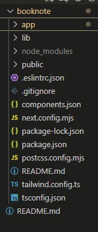
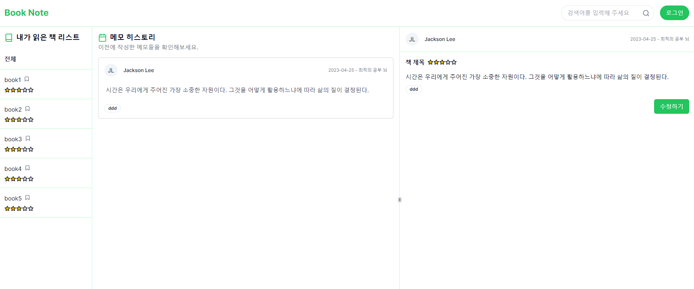

# Next14로 화면 제작하기-BookNote(2)

저번에 계획한 두가지 기능을 바탕으로 화면을 만들어 볼것이다.

---

1. **책 제목 및 메모 시간 기록**: 읽고 있는 책의 제목과 함께 언제 메모했는지를 정확히 기록하여 독서의 흐름을 파악할 수 있게한다.
2. **히스토리 보기**: 책을 다 읽은 후, 기록한 메모들을 시간 순서대로 다시 보며 책의 내용을 깊이 있게 되새겨볼 수 있다.

---

[넥스트 공식 문서](https://nextjs.org/docs/getting-started/installation)를 따라하면 프로젝트 생성은 간단하게 할수있다.

```
npx create-next-app@latest
npm install next@latest react@latest react-dom@latest
```

해당 명령어를 실행하여 프로젝트를 실행하면 위와 같은 프로젝트가 생성된다.



해당 프로젝트에서는 [**shadcn/ui**](https://ui.shadcn.com/) 라는 headless UI를 사용할것이므로

``` 
npx shadcn-ui@latest init
```

해당 명령어를 실행한다. 

### shadcn/ui

다른 ui라이브러리와 다르게 **shadcn/ui**는 headless UI다 여서 headless UI는 컴포넌트가 디자인(UI)를 제공하지 않고 기능에만 집중한 컴포넌트를 말한다.

**shadcn/ui**는 tailwind css기반으로 만든 컴포넌트 모음이다. 따라서 npm으로 의존성관리가 필요없다.

공식문서에서는 다음과 같이 말한다.

> This is NOT a component library. It's a collection of re-usable components that you can copy and paste into your apps.

### 페이지 설계



- 왼쪽에는 내가 저장한 책목록을 보여준다.

- 가운데에는 내가 기록한 메모를 볼수있도록 했다.

- 오른쪽은 해당 메모에 대한 상세보기 이다.


다음에는 화면을 구성할때 필요한 데이터를 정의하고 msw를 적용할 예정이다.
