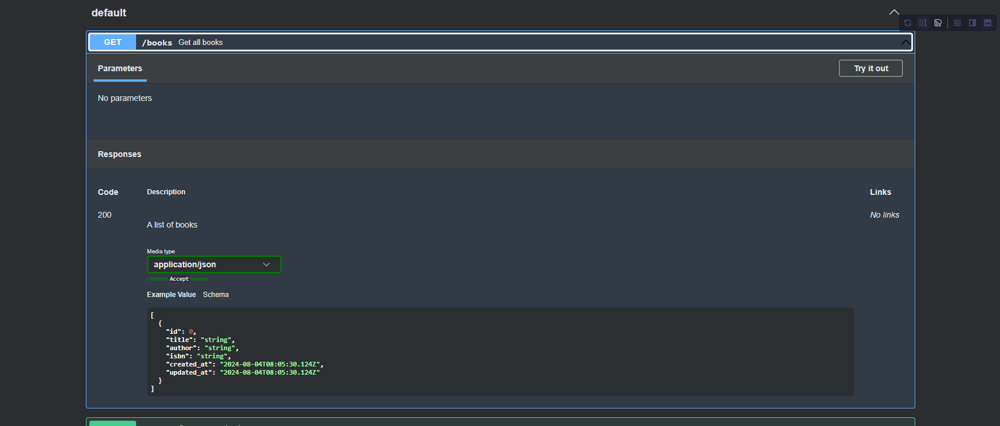

# API 설계 및 DB,Entitiy 구성  BookNote(3)

## 테이블 설계


book은 여러개의 memo를 가질수있으므로 1:n, book과 user는 다대다 관계이므로 사이에 user_books라는 메핑 테이블을 만들었다.

## API설계

open api 3.0 기준에 맞게 사용할 api를 yaml형식으로 정의 하였다,

### schema정의

```yaml
components:
  schemas:
    Book:
      type: object
      properties:
        id:
          type: integer
        title:
          type: string
        author:
          type: string
        isbn:
          type: string
        created_at:
          type: string
          format: date-time
        updated_at:
          type: string
          format: date-time
    User:
      type: object
      properties:
        id:
          type: integer
        username:
          type: string
        password:
          type: string
        email:
          type: string
        created_at:
          type: string
          format: date-time
        updated_at:
          type: string
          format: date-time
//생략
```

일단 테이블 컬럼과 동일하게 설계하였으며, 추후 필요한 response에 맞춰 리팩토링할 예정입니다.

### API 엔드포인트 정의

다음은  API 엔드포인트 정의입니다.

```yaml
openapi: 3.0.0
info:
  title: Book Management API
  description: "API for managing books, users, and notes."
  version: 1.0.0
servers:
  - url: http://localhost:8080/api
    description: SwaggerHub API Auto Mocking
paths:
  /books:
    get:
      summary: Get all books
      responses:
        "200":
          description: A list of books
          content:
            application/json:
              schema:
                type: array
                items:
                  $ref: '#/components/schemas/Book'
    post:
      summary: Create a new book
      requestBody:
        content:
          application/json:
            schema:
              $ref: '#/components/schemas/Book'
        required: true
      responses:
        "201":
          description: Book created
  /books/{id}:
    get:
      summary: Get a book by ID
      parameters:
        - name: id
          in: path
          required: true
          style: simple
          explode: false
          schema:
            type: integer
      responses:
        "200":
          description: A book
          content:
            application/json:
              schema:
                $ref: '#/components/schemas/Book'
        "404":
          description: Book not found
//생략
```

해당 YAML 파일을 IntelliJ IDE에서 확인하면 API 명세를 Swagger UI로 볼 수 있습니다.




## Entitiy 정의

다음은 데이터베이스 테이블에 맞춰 정의한 엔티티들입니다.

### Book Entity

책 정보를 나타내는 Book 엔티티

```java
@Entity
@Table(name = "books")
@Getter
@Setter
@NoArgsConstructor
@AllArgsConstructor
@Builder
public class Book {

    @Id
    @GeneratedValue(strategy = GenerationType.IDENTITY)
    private Long id;

    @Column(nullable = false)
    private String title;

    private String author;

    @Column(name = "created_at", nullable = false, updatable = false)
    @Builder.Default
    private LocalDateTime createdAt = LocalDateTime.now();

    @Column(name = "updated_at", nullable = false)
    @Builder.Default
    private LocalDateTime updatedAt = LocalDateTime.now();
}

```

### User Entitiy

사용자 정보를 나타내는 User 엔티티

```java
@Entity
@Table(name = "users")
@Getter
@Setter
@NoArgsConstructor
@AllArgsConstructor
@Builder
public class User {

    @Id
    @GeneratedValue(strategy = GenerationType.IDENTITY)
    private Long id;

    @Column(unique = true, nullable = false)
    private String username;

    @Column(unique = true, nullable = false)
    private String email;

    @Column(name = "created_at", nullable = false, updatable = false)
    @Builder.Default
    private LocalDateTime createdAt = LocalDateTime.now();

    @Column(name = "updated_at", nullable = false)
    @Builder.Default
    private LocalDateTime updatedAt = LocalDateTime.now();
}

```

### Memo Entity

메모 정보를 나타내는 Memo 엔티티

```java
@Entity
@Table(name = "memos")
@Getter
@Setter
@NoArgsConstructor
@AllArgsConstructor
@Builder
public class Memo {

    @Id
    @GeneratedValue(strategy = GenerationType.IDENTITY)
    private Long id;

    @ManyToOne
    @JoinColumn(name = "book_id", nullable = false)
    private Book book;

    @ManyToOne
    @JoinColumn(name = "user_id", nullable = false)
    private User user;

    @Column(nullable = false)
    private String memo;

    @Column(name = "created_at", nullable = false, updatable = false)
    @Builder.Default
    private LocalDateTime createdAt = LocalDateTime.now();

    @Column(name = "updated_at", nullable = false)
    @Builder.Default
    private LocalDateTime updatedAt = LocalDateTime.now();
}

```

### UserMemo Entitiy

사용자와 책의 매핑 정보를 나타내는 UserMemo 엔티티

```java
@Entity
@Table(name = "user_books")
@Getter
@Setter
@NoArgsConstructor
@AllArgsConstructor
@Builder
public class UserMemo {

    @Id
    @GeneratedValue(strategy = GenerationType.IDENTITY)
    private Long id;

    @ManyToOne
    @JoinColumn(name = "user_id", nullable = false)
    private User user;

    @ManyToOne
    @JoinColumn(name = "book_id", nullable = false)
    private Book book;

    private Integer rating;

    @Column(nullable = false)
    private boolean bookmark;

    @Column(name = "created_at", nullable = false, updatable = false)
    @Builder.Default
    private LocalDateTime createdAt = LocalDateTime.now();

    @Column(name = "updated_at", nullable = false)
    @Builder.Default
    private LocalDateTime updatedAt = LocalDateTime.now();
}

```

이렇게 테이블에 맞춰 엔티티를 정의했습니다. 다음 단계로, 해당 엔티티를 바탕으로 API를 구현할 예정입니다.